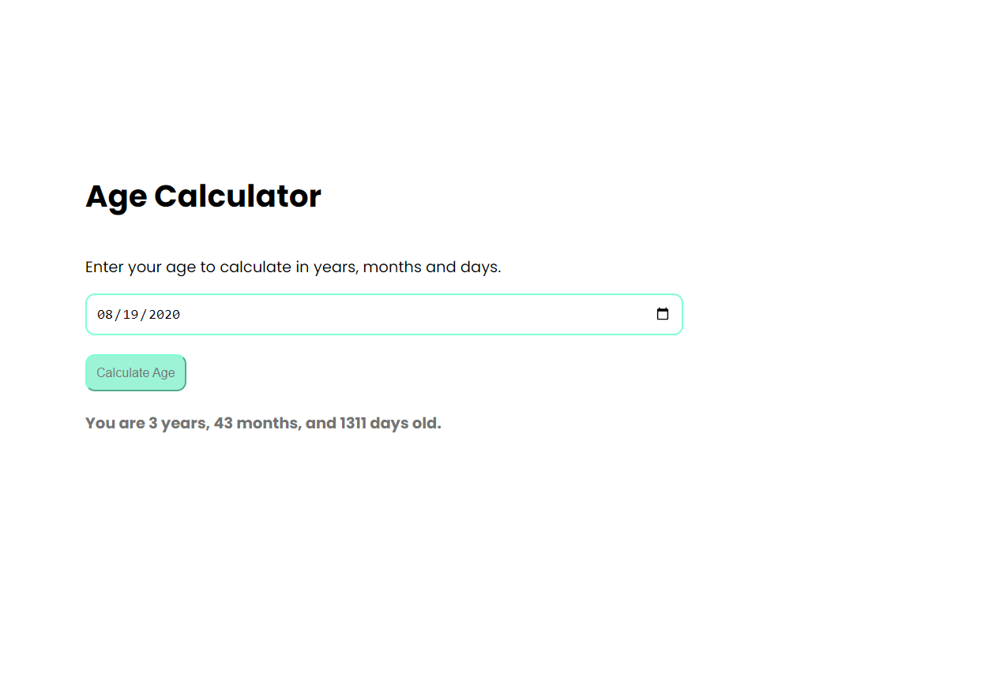
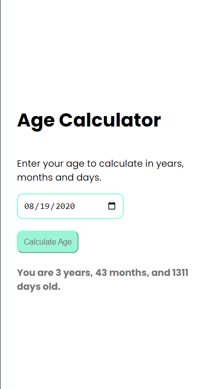

# Age Calculator App

This is a simple Age Calculator web application built using React, HTML, CSS (with Tailwind CSS), and JavaScript. The app allows users to input their birth date and calculates their age based on the current date.

## Features

- Calculate age based on the input birth date.
- Mobile responsive design.
- Built with React for dynamic user interface.
- Styled using Tailwind CSS for a modern and sleek look.

## Demo

You can view a live demo of the Age Calculator App [here](#).

## Installation

To run this project locally, follow these steps:

1. Clone the repository:

   
   git clone <https://github.com/DeshanBandara/Age-Calculator.git>
   cd frontend
   npm install
   npm run dev

